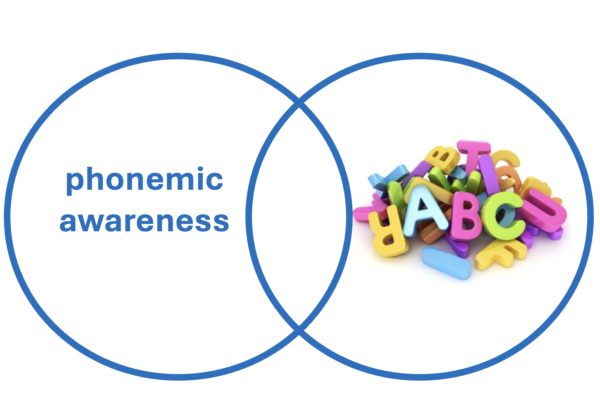

# Arabic Phoneme & Syllable Analysis 🕌🔤

A Python implementation that converts diacritized Arabic text into phoneme sequences and syllable patterns using regular expression-based phonological rules. Validated on three Quranic Suras against expert-annotated reference data.

<div align="center">
  
</div>

<br>
<div align="center">
  <a href="https://codeload.github.com/TendoPain18/arabic-phoneme-syllable-analysis/legacy.zip/main">
    
  </a>
</div>

## 📋 Description

This project implements a complete pipeline for Arabic text processing that converts written Arabic with diacritics (Tashkeel) into phoneme sequences and syllable patterns. The system applies six groups of phonological rules using Python's `re` module, following the phoneme set defined in a published research paper (M. Ali et al.). It is validated against Suras 112 (Al-Ikhlas), 113 (Al-Falaq), and 114 (An-Nas).

## 🎯 Project Objectives

1. Define Arabic character classes, diacritics, and a letter-to-phoneme mapping table
2. Implement six groups of regex-based phonological rules (Tanween, Shadda, Semi-vowels, Al-Lam, Consonant Assimilation)
3. Convert Arabic orthographic text into phoneme sequences
4. Classify phoneme sequences into syllable patterns (CV, CVC, CVV, CVVC, CVCC)
5. Generate numeric representations of syllable sequences
6. Validate output against expert-annotated reference patterns

## ✨ Features

- **5-Stage Processing Pipeline**: Character definition → Phoneme mapping → Rule application → Phoneme extraction → Syllabification
- **6 Groups of Phonological Rules**: Tanween, Gemination (Shadda), Semi-vowels, Al-Lam al-Shamseyyah, and Consonant Assimilation
- **Syllable Classifier**: Identifies CV, CVC, CVV, CVVC, CVCC, and CX (unknown) patterns
- **Numeric Encoder**: Maps each syllable type to a numeric code (1–6)
- **Accuracy Evaluation**: Compares generated sequences against reference annotations

## 🔬 Syllable Classification System

| Code | Pattern | Description | Example |
|------|---------|-------------|---------|
| 1 | CV | Consonant + Short vowel (Open short) | بِ، كَ |
| 2 | CVC | Consonant + Short vowel + Consonant (Closed short) | قُلْ، مِنْ |
| 3 | CVV | Consonant + Long vowel (Open long) | قَا، لِي |
| 4 | CVVC | Consonant + Long vowel + Consonant (Closed long) | قُول |
| 5 | CVCC | Consonant + Vowel + Two consonants (Super-heavy) | بِنْت |
| 6 | CX | Unknown or error patterns | N/A |

## 📊 Results

| Sura | Name | Total Syllables | CV | CVC | CVV | Accuracy |
|------|------|-----------------|-----|------|------|----------|
| 112 | Al-Ikhlas (الإخلاص) | 34 | 19 | 9 | 6 | **100.0%** ✅ |
| 113 | Al-Falaq (الفلق) | 53 | 36 | 10 | 4 | **78.4%** |
| 114 | An-Nas (الناس) | 48 | 24 | 8 | 6 | **62.5%** |
| **Total** | | **135** | **79 (58.5%)** | **27 (20.0%)** | **16 (11.9%)** | **78.2%** |

**Key Findings:**
- CV syllables dominate at 58.5%, consistent with Arabic phonological theory
- Perfect 100% accuracy on Sura 112 (Al-Ikhlas)
- No super-heavy (CVCC) syllables observed in this dataset

## 🔧 Processing Pipeline

```
Arabic Text (with diacritics)
        ↓
1. Character & Diacritic Definition
        ↓
2. Letter-to-Phoneme Mapping Table
        ↓
3. Regex Rule Application (6 groups)
        ↓
4. Phoneme Sequence Extraction
        ↓
5. Syllabification & Pattern Classification
        ↓
Output: Syllable Patterns + Numeric Codes
```

## 🚀 Getting Started

### Prerequisites

```
Python 3.7+
re (built-in)
```

### Installation

```bash
git clone https://github.com/TendoPain18/arabic-phoneme-syllable-analysis.git
cd arabic-phoneme-syllable-analysis
```

### Usage

```python
# Run the notebook
jupyter notebook RegEx_HW2.ipynb

# Or use the functions directly
from solution import text_to_phonemes, phonemes_to_syllables, syllables_to_numbers

phonemes = text_to_phonemes("قُلْ هُوَ اللَّهُ أَحَدٌ")
syllables = phonemes_to_syllables(phonemes)
numbers = syllables_to_numbers(syllables)

print(syllables)  # ['CVC', 'CV', 'CVV', 'CVV', ...]
print(numbers)    # [2, 1, 3, 3, ...]
```

## 🙏 Acknowledgments

- Course: Speech Processing — Communications and Information Engineering, Zewail City University of Science and Technology

<br>
<div align="center">
  <a href="https://codeload.github.com/TendoPain18/arabic-phoneme-syllable-analysis/legacy.zip/main">
    
  </a>
</div>

## <!-- CONTACT -->
<div id="toc" align="center">
  <ul style="list-style: none">
    <summary>
      <h2 align="center">
        🚀
        CONTACT ME
        🚀
      </h2>
    </summary>
  </ul>
</div>
<table align="center" style="width: 100%; max-width: 600px;">
<tr>
  <td style="width: 20%; text-align: center;">
    <a href="https://www.linkedin.com/in/amr-ashraf-86457134a/" target="_blank">
      
    </a>
  </td>
  <td style="width: 20%; text-align: center;">
    <a href="https://github.com/TendoPain18" target="_blank">
      
    </a>
  </td>
  <td style="width: 20%; text-align: center;">
    <a href="mailto:amrgadalla01@gmail.com">
      
    </a>
  </td>
  <td style="width: 20%; text-align: center;">
    <a href="https://www.facebook.com/amr.ashraf.7311/" target="_blank">
      
    </a>
  </td>
  <td style="width: 20%; text-align: center;">
    <a href="https://wa.me/201019702121" target="_blank">
      
    </a>
  </td>
</tr>
</table>
<!-- END CONTACT -->

## **Bridging Arabic linguistics and computational phonology! 🕌✨**
